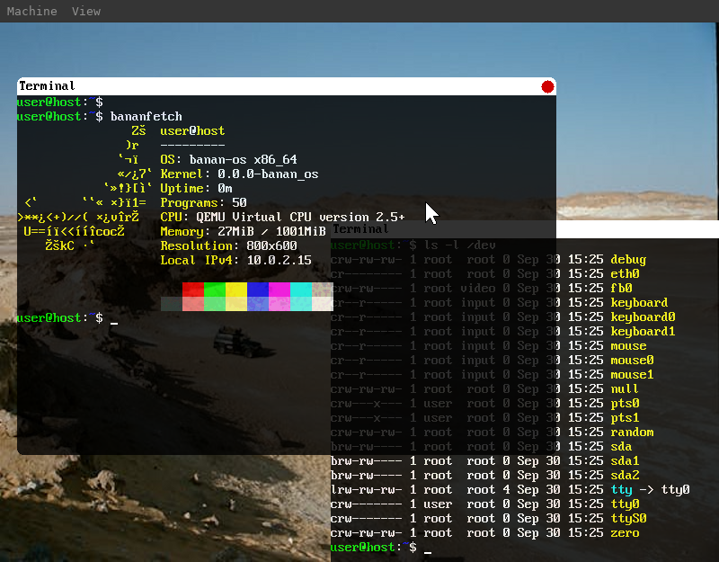

[](https://git.bananymous.com/Bananymous/banan-os)
[](https://git.bananymous.com/Bananymous/banan-os)
[](https://git.bananymous.com/Bananymous/banan-os/src/branch/main/LICENSE)
[](https://discord.gg/ehjGySwYdK)

# banan-os

This is my hobby operating system written in C++. Currently supports x86\_64 and i686 architectures.

You can find a live demo [here](https://bananymous.com/banan-os)

### Features

#### General
- [x] Ring3 userspace
- [x] SMP (multiprocessing)
- [x] Linear framebuffer (VESA and GOP)
- [x] Network stack
- [x] ELF executable loading
- [x] AML interpreter (partial)
- [ ] ELF dynamic linking
- [ ] Graphical desktop

#### Drivers
- [x] NVMe disks
- [x] ATA (IDE, SATA) disks
- [x] E1000 and E1000E NICs
- [x] PS2 keyboard (all scancode sets)
- [x] PS2 mouse

#### Network
- [x] ARP
- [x] ICMP
- [x] IPv4
- [x] UDP
- [x] TCP (partial and buggy)
- [x] Unix domain sockets

#### Filesystems
- [x] Virtual filesystem
- [x] Ext2
- [x] FAT12/16/32
- [x] Dev
- [x] Ram
- [x] Proc
- [ ] Sys

#### Bootloader support
- [x] GRUB
- [x] Custom BIOS bootloader
- [ ] Custom UEFI bootloader



## Code structure

Each major component and library has its own subdirectory (kernel, userspace, libc, ...). Each directory contains directory *include*, which has **all** of the header files of the component. Every header is included by its absolute path.

## Building

### Needed packages

#### apt (tested on ubuntu 22.04)
```# apt install build-essential git ninja-build texinfo bison flex libgmp-dev libmpfr-dev libmpc-dev parted qemu-system-x86 cpu-checker```

#### pacman
```# pacman -S --needed base-devel git wget cmake ninja parted qemu-system-x86```


### Compilation

To build the toolchain for this os. You can run the following command.
> ***NOTE:*** The following step has to be done only once. This might take a long time since we are compiling binutils and gcc.
```sh
./bos toolchain
```

To build the os itself you can run one of the following commands. You will need root access for disk image creation/modification.
```sh
./bos qemu
./bos qemu-nographic
./bos qemu-debug
./bos bochs
```

You can also build the kernel or disk image without running it:
```sh
./bos kernel
./bos image
```

To build for other architectures set environment variable BANAN\_ARCH=*arch* (e.g. BANAN\_ARCH=i686).

To change the bootloader you can set environment variable BANAN\_BOOTLOADER; supported values are BANAN (my custom bootloader) and GRUB.

To run with UEFI set environment variable BANAN\_UEFI\_BOOT=1. You will also have to set OVMF\_PATH to the correct OVMF (default */usr/share/ovmf/x64/OVMF.fd*).

If you have corrupted your disk image or want to create new one, you can either manually delete *build/banan-os.img* and build system will automatically create you a new one or you can run the following command.
```sh
./bos image-full
```

I have also created shell completion script for zsh. You can either copy the file in _script/shell-completion/zsh/\_bos_ to _/usr/share/zsh/site-functions/_ or add the _script/shell-completion/zsh_ to your fpath in _.zshrc_.

## Contributing

As the upstream is hosted on my server https://git.bananymous.com/Bananymous/banan-os, please contact me about account creation ([email](mailto:oskari.alaranta@bananymous.com), [discord](https://discord.gg/xMXKt9Wf)) and I will add a account for you. This is done to limit the people with access to the server.

As this is mostly a learning experience for me, I would appreciate if you first contacted me about adding new features (email, discord, issue, ...). Bug fixes are always welcome!

Commit message should be formatted followingly

  1. First line is of the form "_Subject: Description_", where _Subject_ tells the area touched (Kernel, Shell, BuildSystem, ...) and _Description_ is brief description of the change done. First line should fit fully in 70 characters.
  2. Body of the message should further describe the change and reasoning behind the change.

All commits should pass the pre-commit hook defined in _.pre-commit-config.yaml_. For instructions on how to setup pre-commit, please see https://pre-commit.com/#install.
